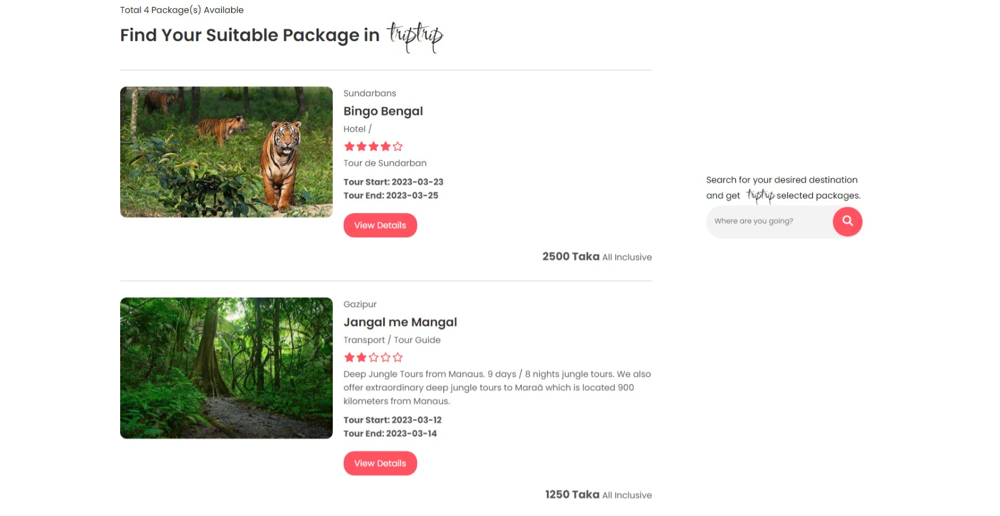
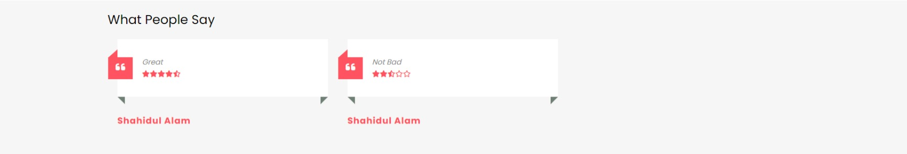
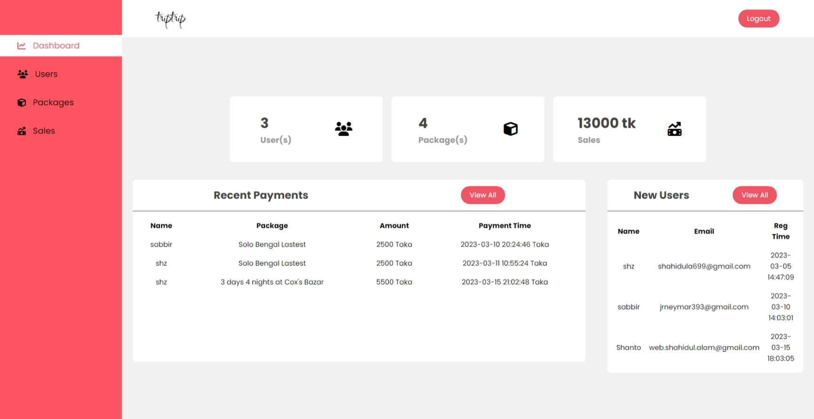
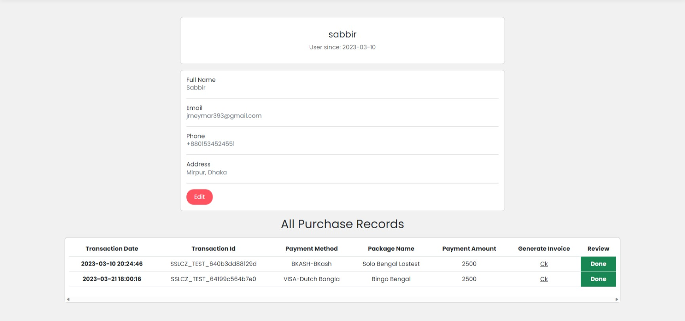

# Triptrip - Travel Agency Solution

Triptrip is fullstack website that handles management of various tour and travel packages. 
- Users can **browse**, **search**, **buy** packages therefore generate **pdf reports**, write **reviews** and everything is done in realtime.
- Admin user can manage **users**, **tour packages**, **sales**, generate **pdf reports** accordingly.
- Raw PHP is used to script the backend.

## Key Features
### Users
- User validation added on login and sign up. Username and email fields are unique. User will get mail after completing registration. (**undo smtp_mailer comment**)

- Package purchase validation added. One user can not purchase same package twice, can not purchase after package has started and also can not purchase after package capacity is full.

- User will get email after completing purchase. (**undo smtp_mailer comment in *success.php* file**)

- User can write review and generate pdf report after purchasing any package and *more*.

### Admin

- View, add, modify  packages.
- Manage users. (Active/Inactive)
- View and generate pdf report on sales.

## Known Bugs

Checkout the **dbConnection.php** file for the known bugs. 


# Getting Started

Clone the repository

```bash
  git clone https://github.com/shz-code/triptrip.git
```

## Prerequisites

You need to have a PHP enabled apache with mysql server installed on your local device.

You can use -
- [XAMPP](https://www.apachefriends.org/index.html)
- [Laragon](https://laragon.org/)

Code editor -
- [Vscode](https://code.visualstudio.com/)
- [PhpStorm](https://www.jetbrains.com/phpstorm/)

## Installation

- Start Apache and Mysql.
- Extract downloaded project file
- Rename the extracted folder to **triptip**.
- Copy the extracted folder to htdocs(XAMPP) or www(Laragon) folder.
- Create a new database named **triptrip** and create required table. Use the [tableSchemas](./tableSchemas.txt) to create tables.

- Open your browser and go to [http://localhost/triptrip](http://localhost/triptrip)

- Go to register and sign up using new user.
- To make a user admin go to your database -> triptip -> users -> **set *is_admin* to 1**.
- Separate dashboards for **admin** and **users**. Use **admin** dashboard to start adding new packages.
# Please note

- All the SQL codes are written in **dbConnection.php** file.
- The file structure is modular. You will get components folder containing the common HTML for all pages like head, header, and footer.
- This project uses **SSL Commerz** sandbox as payment gateway. Change the required code in **_checkout.php** and **success.php** to set up your sandbox. Visit [SSL Commerz](https://developer.sslcommerz.com/) to know more.
- This project uses **PHPMailer** to send emails to user on various occasions. Change the **$mail->Username** and **$mail->Password** according your mail address to start sending emails. Checkout [PHPMailer](https://github.com/PHPMailer/PHPMailer) to know more.

## Screenshots
- Search for desired package directly from landing page based on location

- Get all listed packages or search for desired package based on location

- Updated package rating after user review

- Optional available package features

- User reviews

- Admin Dashboard to control the website

- User dashboard to control user info and purchase info

- SSL Commmerz payment gateway for completing purchase


# Built With
 The scripting language used


The relational database management system used

# Authors
**Shahidul Alam** - [@shz-code](https://github.com/shz-code)

**Akibul Hasan** - [@MdAkibulHasan](https://github.com/MdAkibulHasan)

# License
[](https://choosealicense.com/licenses/mit/)

This project is licensed under the MIT License - see the LICENSE file for details
# Acknowledgments
- Design Inspired
